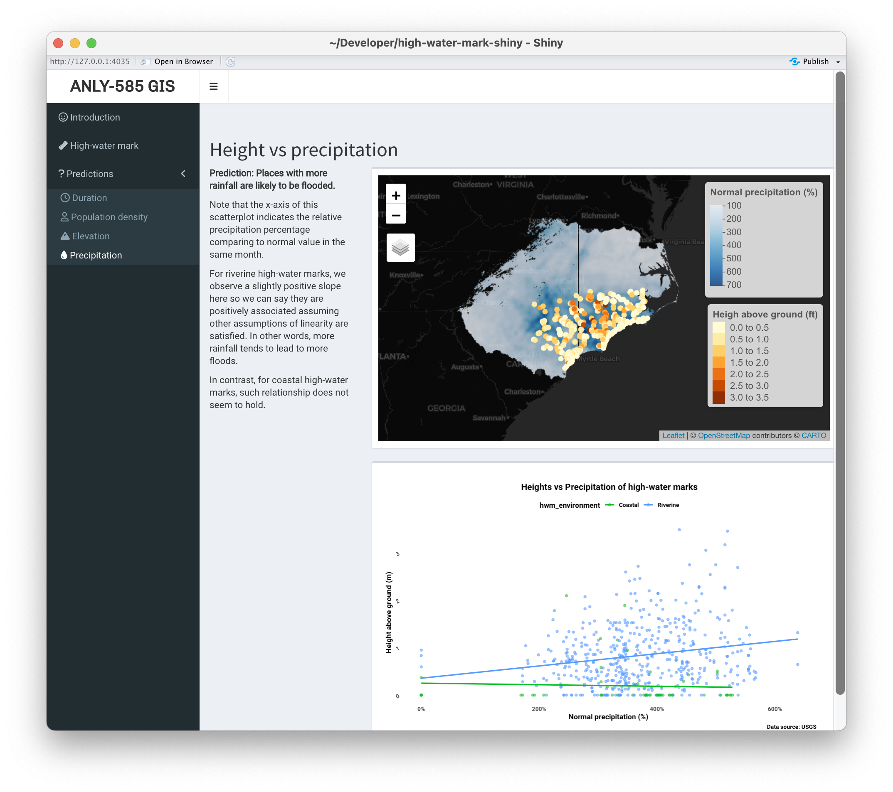

# README

A **high-water mark** is the highest point that a body of water reaches during a flood event. In the context of GIS, high-water marks are important because they help to determine the extent of flooding and the potential damage that may have occurred. By using spatial data and mapping technologies, we can better understand floods and make more informed decisions about how to respond to and mitigate the impacts of flood events.

However, collecting data of an flooding event can be quite dangerous if there's no monitoring system we can rely on. Hydrologists or researchers would travel outside in extreme weather conditions to acquire real-time data. So one of the goals of this Shiny application is to examine our current knowledge of high-water marks and try to learn more about the patterns within, which could possibly help us expand flood monitoring system.

> If you consider a river as a curve, there are infinitely many points along the line, so the question is **WHERE** to place those sensor?

## Data

- [`florence.tif`](https://global-flood-database.cloudtostreet.ai/#interactive-map): FLooding data of Hurricane Florence in 2018.
- [`highwatermark.csv`](https://stn.wim.usgs.gov/FEV/#2018Florence): High-water mark locations during the flood event of Hurricane Florence.
- [`precip.tif`](https://water.weather.gov/precip/download.php): National precipitation of September 2018.
- [`10_DEM_y30x-90.tif`](https://ec.europa.eu/eurostat/web/gisco/geodata/reference-data/elevation/copernicus-dem/elevation): DEM data of the tile where South Carolina roughly is.
- [`10_DEM_y30x-80.tif`](https://ec.europa.eu/eurostat/web/gisco/geodata/reference-data/elevation/copernicus-dem/elevation): DEM data of the tile where North Carolina roughly is.
- [`usa_pd_2018_1km.tif`](https://hub.worldpop.org/geodata/summary?id=39728): Population density of 1km resolution in the affected area.

## References

- R Packages
  - [`shiny`](https://cran.r-project.org/web/packages/shiny/index.html)
  - [`shinydashboard`](https://cran.r-project.org/web/packages/shinydashboard/index.html)
  - [`DT`](https://cran.r-project.org/web/packages/DT/index.html)
  - [`sf`](https://cran.r-project.org/web/packages/sf/index.html)
  - [`tmap`](https://cran.r-project.org/web/packages/tmap/index.html)
  - [`terra`](https://cran.r-project.org/web/packages/terra/index.html)
  - [`tidyverse`](https://cran.r-project.org/web/packages/tidyverse/index.html)
- Font
  - [Roboto](https://fonts.google.com/specimen/Roboto)
- Publications
  - [Identifying and preserving high-water mark data (Koenig et al 2016)](https://pubs.er.usgs.gov/publication/tm3A24)
  - [High Water Mark Collection forHurricane Katrina in Alabama (Federal Emergency Management Agency 2006)](https://www.fema.gov/pdf/hazard/flood/recoverydata/katrina/katrina_al_hwm_public.pdf)

***

- [Prior analysis repository](https://github.com/rexarski/gis_project_floods)
- [Source code](https://github.com/rexarski/high-water-mark-shiny)
